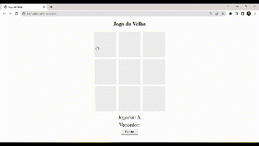

# Jogo da Velha
Projeto desenvolvido na plataforma DIO, com a finalidade de estudar a linguagem Javascript.

Clique <a href="https://isabellacpmelo.github.io/jogo-da-velha/">aqui</a> para acessar o projeto.

<a href="https://isabellacpmelo.github.io/jogo-da-velha/"> 

## Ferramentas utilizadas:
* HTML5
* CSS3
* Javascript

## Print do Projeto
  
### Página do jogo

